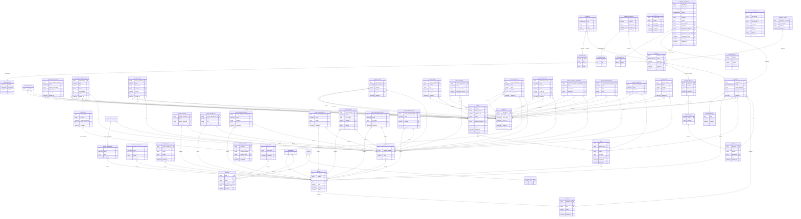

```mermaid
erDiagram

        EvidenciaTipo {
            imagen imagen
pdf pdf
planilla planilla
otro otro
        }
    


        MilestoneEstado {
            pendiente pendiente
completado completado
validado validado
rechazado rechazado
        }
    


        TrazabilidadEstado {
            draft draft
en_curso en_curso
finalizada finalizada
certificada certificada
        }
    


        ValidadoPorTipo {
            sistema sistema
ia ia
tecnico tecnico
        }
    


        SeveridadRegla {
            bloqueo bloqueo
alerta alerta
info info
        }
    


        EstadoHallazgo {
            abierto abierto
en_proceso en_proceso
resuelto resuelto
aceptado aceptado
anulado anulado
        }
    
  "app_user" {
    String user_id "🗝️"
    String nombre 
    String email "❓"
    DateTime created_at 
    String password_hash "❓"
    Boolean is_active 
    }
  

  "bodega" {
    String bodega_id "🗝️"
    String nombre 
    String razon_social "❓"
    String cuit "❓"
    Boolean activo 
    DateTime created_at 
    DateTime updated_at 
    }
  

  "campania" {
    String campania_id "🗝️"
    String nombre 
    DateTime fecha_inicio 
    DateTime fecha_fin 
    String estado 
    DateTime created_at 
    DateTime updated_at 
    }
  

  "capacitacion_asistente" {

    }
  

  "cuartel" {
    String cuartel_id "🗝️"
    String codigo_cuartel 
    Decimal superficie_ha "❓"
    String cultivo "❓"
    String variedad "❓"
    String sistema_productivo "❓"
    String sistema_conduccion "❓"
    Boolean activo 
    DateTime created_at 
    DateTime updated_at 
    }
  

  "cuartel_campania" {
    String estado 
    }
  

  "evento_accidente" {
    String evento_accidente_id "🗝️"
    DateTime fecha 
    String accion_correctiva "❓"
    DateTime created_at 
    }
  

  "evento_analisis_suelo" {
    String evento_analisis_suelo_id "🗝️"
    DateTime fecha 
    String unidad_muestreada 
    String laboratorio "❓"
    Json parametros 
    DateTime created_at 
    }
  

  "evento_aplicacion_fitosanitaria" {
    String evento_fito_id "🗝️"
    DateTime fecha 
    Decimal dosis 
    String unidad 
    Int carencia_dias 
    String motivo "❓"
    DateTime created_at 
    }
  

  "evento_canopia" {
    String evento_canopia_id "🗝️"
    DateTime fecha 
    String tipo_practica 
    String intensidad "❓"
    Decimal jornales "❓"
    String observaciones "❓"
    DateTime created_at 
    }
  

  "evento_capacitacion" {
    String evento_capacitacion_id "🗝️"
    DateTime fecha 
    String tema 
    DateTime created_at 
    }
  

  "evento_cosecha" {
    String lote_cosecha_id "🗝️"
    DateTime fecha_cosecha 
    Decimal cantidad 
    String unidad 
    String destino "❓"
    DateTime created_at 
    }
  

  "evento_energia" {
    String evento_energia_id "🗝️"
    String periodo 
    String tipo 
    Decimal consumo 
    String unidad 
    DateTime created_at 
    }
  

  "evento_entrega_epp" {
    String evento_entrega_epp_id "🗝️"
    DateTime fecha 
    String epp 
    DateTime created_at 
    }
  

  "evento_fenologia" {
    String evento_fenologia_id "🗝️"
    DateTime fecha 
    String estado_fenologico 
    Decimal porcentaje_avance "❓"
    DateTime created_at 
    }
  

  "evento_fertilizacion" {
    String evento_fertilizacion_id "🗝️"
    DateTime fecha 
    Decimal dosis 
    String unidad 
    Decimal cantidad_total "❓"
    DateTime created_at 
    }
  

  "evento_labor_suelo" {
    String evento_labor_suelo_id "🗝️"
    DateTime fecha 
    String tipo_labor 
    Decimal horas "❓"
    Decimal hs_por_ha "❓"
    Decimal total_horas_cuartel "❓"
    DateTime created_at 
    }
  

  "evento_limpieza_cosecha" {
    String evento_limpieza_cosecha_id "🗝️"
    DateTime fecha 
    String elemento 
    String metodo "❓"
    DateTime created_at 
    }
  

  "evento_mantenimiento" {
    String evento_mantenimiento_id "🗝️"
    DateTime fecha 
    String equipo 
    String tipo 
    DateTime created_at 
    }
  

  "evento_monitoreo_enfermedad" {
    String evento_monitoreo_enfermedad_id "🗝️"
    DateTime fecha 
    String enfermedad 
    String incidencia "❓"
    DateTime created_at 
    }
  

  "evento_monitoreo_plaga" {
    String evento_monitoreo_plaga_id "🗝️"
    DateTime fecha 
    String plaga 
    String nivel "❓"
    DateTime created_at 
    }
  

  "evento_no_conforme" {
    String evento_no_conforme_id "🗝️"
    DateTime fecha 
    String descripcion 
    String estado 
    DateTime created_at 
    }
  

  "evento_precipitacion" {
    String evento_precipitacion_id "🗝️"
    DateTime fecha 
    Decimal milimetros 
    DateTime created_at 
    }
  

  "evento_reclamo" {
    String evento_reclamo_id "🗝️"
    DateTime fecha 
    String origen 
    String estado 
    String descripcion "❓"
    DateTime created_at 
    }
  

  "evento_residuo" {
    String evento_residuo_id "🗝️"
    DateTime fecha 
    String tipo_residuo 
    Decimal cantidad "❓"
    String unidad "❓"
    String destino 
    DateTime created_at 
    }
  

  "evento_riego" {
    String evento_riego_id "🗝️"
    DateTime fecha 
    Decimal volumen 
    String unidad 
    String sistema_riego "❓"
    DateTime created_at 
    }
  

  "evento_sanitizacion_banos" {
    String evento_sanitizacion_banos_id "🗝️"
    DateTime fecha 
    String tipo_bano 
    Json checklist 
    DateTime created_at 
    }
  

  "evento_sobrante_lavado" {
    String evento_sobrante_lavado_id "🗝️"
    DateTime fecha 
    String tipo 
    Decimal volumen "❓"
    String disposicion "❓"
    DateTime created_at 
    }
  

  "evidencia" {
    String evidencia_id "🗝️"
    EvidenciaTipo tipo 
    String url 
    String hash "❓"
    DateTime created_at 
    }
  

  "finca" {
    String finca_id "🗝️"
    String nombre_finca 
    String rut "❓"
    String renspa "❓"
    String catastro "❓"
    String ubicacion_texto "❓"
    DateTime created_at 
    DateTime updated_at 
    }
  

  "insumo_catalogo" {
    String insumo_id "🗝️"
    String tipo 
    String nombre_comercial 
    String principio_activo "❓"
    String unidad_base 
    DateTime created_at 
    }
  

  "insumo_lote" {
    String insumo_lote_id "🗝️"
    String nro_lote 
    DateTime fecha_vencimiento 
    String estado 
    DateTime created_at 
    }
  

  "milestone" {
    String milestone_id "🗝️"
    MilestoneEstado estado 
    DateTime event_date "❓"
    String created_by "❓"
    DateTime created_at 
    DateTime updated_at 
    }
  

  "milestone_evento" {
    String milestone_evento_id "🗝️"
    String evento_tabla 
    String evento_id 
    DateTime created_at 
    }
  

  "persona" {
    String persona_id "🗝️"
    String nombre_apellido 
    String tipo 
    Boolean activo 
    DateTime created_at 
    }
  

  "productor" {
    String productor_id "🗝️"
    String razon_social 
    String cuit "❓"
    Boolean activo 
    DateTime created_at 
    DateTime updated_at 
    }
  

  "protocolo" {
    String protocolo_id "🗝️"
    String nombre 
    String version 
    String descripcion "❓"
    Boolean activo 
    DateTime created_at 
    }
  

  "protocolo_etapa" {
    String etapa_id "🗝️"
    String nombre 
    Int orden 
    }
  

  "protocolo_proceso" {
    String proceso_id "🗝️"
    String nombre 
    String evento_tipo 
    Boolean obligatorio 
    Int orden 
    }
  

  "refresh_token" {
    String token_id "🗝️"
    String token_hash 
    DateTime expires_at 
    DateTime revoked_at "❓"
    DateTime created_at 
    }
  

  "rol" {
    String rol_id "🗝️"
    String nombre 
    }
  

  "trazabilidad" {
    String trazabilidad_id "🗝️"
    TrazabilidadEstado estado 
    String nombre_producto "❓"
    String imagen_producto "❓"
    DateTime created_at 
    DateTime updated_at 
    }
  

  "config_regla" {
    String config_regla_id "🗝️"
    String codigo 
    Json valor_json 
    String descripcion "❓"
    DateTime created_at 
    DateTime updated_at 
    }
  

  "hallazgo_cumplimiento" {
    String hallazgo_id "🗝️"
    String regla_codigo 
    SeveridadRegla severidad 
    EstadoHallazgo estado 
    String titulo 
    String mensaje 
    Json detalle 
    String evento_tabla "❓"
    String evento_id "❓"
    String justificacion_categoria "❓"
    String justificacion_texto "❓"
    String justificacion_responsable "❓"
    DateTime justificacion_fecha "❓"
    DateTime created_at 
    DateTime updated_at 
    DateTime resolved_at "❓"
    }
  

  "evento_fingerprint" {
    String evento_fingerprint_id "🗝️"
    String tipo_evento 
    String hash_contenido 
    String evento_tabla 
    String evento_id 
    DateTime fecha 
    String cuartel_id "❓"
    String finca_id "❓"
    DateTime created_at 
    }
  

  "user_bodega" {
    String rol_en_bodega 
    }
  

  "user_rol" {

    }
  

  "validacion_milestone" {
    String validacion_id "🗝️"
    Boolean validado 
    String observacion "❓"
    ValidadoPorTipo validado_por 
    DateTime created_at 
    }
  
    "bodega" }o--|o productor : "productor"
    "capacitacion_asistente" }o--|| evento_capacitacion : "evento_capacitacion"
    "capacitacion_asistente" }o--|| persona : "persona"
    "cuartel" }o--|| finca : "finca"
    "cuartel_campania" }o--|| campania : "campania"
    "cuartel_campania" }o--|| cuartel : "cuartel"
    "evento_accidente" }o--|o bodega : "bodega"
    "evento_accidente" }o--|| persona : "persona"
    "evento_analisis_suelo" }o--|o campania : "campania"
    "evento_analisis_suelo" }o--|o cuartel : "cuartel"
    "evento_aplicacion_fitosanitaria" }o--|| campania : "campania"
    "evento_aplicacion_fitosanitaria" }o--|| cuartel : "cuartel"
    "evento_aplicacion_fitosanitaria" }o--|o insumo_lote : "insumo_lote"
    "evento_aplicacion_fitosanitaria" }o--|o persona : "persona"
    "evento_canopia" }o--|| campania : "campania"
    "evento_canopia" }o--|| cuartel : "cuartel"
    "evento_canopia" }o--|o persona : "persona"
    "evento_capacitacion" }o--|o bodega : "bodega"
    "evento_cosecha" }o--|| campania : "campania"
    "evento_cosecha" }o--|| cuartel : "cuartel"
    "evento_cosecha" }o--|o persona : "persona"
    "evento_energia" }o--|o campania : "campania"
    "evento_energia" }o--|o cuartel : "cuartel"
    "evento_entrega_epp" }o--|o bodega : "bodega"
    "evento_entrega_epp" }o--|| persona : "persona"
    "evento_fenologia" }o--|| campania : "campania"
    "evento_fenologia" }o--|| cuartel : "cuartel"
    "evento_fenologia" }o--|o persona : "persona"
    "evento_fertilizacion" }o--|| campania : "campania"
    "evento_fertilizacion" }o--|| cuartel : "cuartel"
    "evento_fertilizacion" }o--|o insumo_catalogo : "insumo_catalogo"
    "evento_fertilizacion" }o--|o persona : "persona"
    "evento_labor_suelo" }o--|| campania : "campania"
    "evento_labor_suelo" }o--|| cuartel : "cuartel"
    "evento_labor_suelo" }o--|o persona : "persona"
    "evento_limpieza_cosecha" }o--|o bodega : "bodega"
    "evento_limpieza_cosecha" }o--|o persona : "persona"
    "evento_mantenimiento" }o--|o bodega : "bodega"
    "evento_mantenimiento" }o--|o persona : "persona"
    "evento_monitoreo_enfermedad" }o--|| campania : "campania"
    "evento_monitoreo_enfermedad" }o--|| cuartel : "cuartel"
    "evento_monitoreo_enfermedad" }o--|o persona : "persona"
    "evento_monitoreo_plaga" }o--|| campania : "campania"
    "evento_monitoreo_plaga" }o--|| cuartel : "cuartel"
    "evento_monitoreo_plaga" }o--|o persona : "persona"
    "evento_no_conforme" }o--|o bodega : "bodega"
    "evento_precipitacion" }o--|o campania : "campania"
    "evento_precipitacion" }o--|| finca : "finca"
    "evento_reclamo" }o--|o bodega : "bodega"
    "evento_residuo" }o--|o bodega : "bodega"
    "evento_residuo" }o--|o persona : "persona"
    "evento_riego" }o--|| campania : "campania"
    "evento_riego" }o--|| cuartel : "cuartel"
    "evento_riego" }o--|o persona : "persona"
    "evento_sanitizacion_banos" }o--|o bodega : "bodega"
    "evento_sanitizacion_banos" }o--|o persona : "persona"
    "evento_sobrante_lavado" }o--|o bodega : "bodega"
    "evento_sobrante_lavado" }o--|o persona : "persona"
    "evidencia" |o--|| "EvidenciaTipo" : "enum:tipo"
    "evidencia" }o--|| milestone : "milestone"
    "finca" }o--|| bodega : "bodega"
    "insumo_lote" }o--|| insumo_catalogo : "insumo_catalogo"
    "milestone" |o--|| "MilestoneEstado" : "enum:estado"
    "milestone" }o--|| protocolo_proceso : "protocolo_proceso"
    "milestone" }o--|| trazabilidad : "trazabilidad"
    "milestone_evento" }o--|| milestone : "milestone"
    "persona" }o--|o bodega : "bodega"
    "protocolo_etapa" }o--|| protocolo : "protocolo"
    "protocolo_proceso" }o--|| protocolo_etapa : "protocolo_etapa"
    "refresh_token" }o--|| app_user : "app_user"
    "trazabilidad" |o--|| "TrazabilidadEstado" : "enum:estado"
    "trazabilidad" }o--|| bodega : "bodega"
    "trazabilidad" }o--|| campania : "campania"
    "trazabilidad" }o--|| cuartel : "cuartel"
    "trazabilidad" }o--|| finca : "finca"
    "trazabilidad" }o--|o productor : "productor"
    "trazabilidad" }o--|| protocolo : "protocolo"
    "hallazgo_cumplimiento" |o--|| "SeveridadRegla" : "enum:severidad"
    "hallazgo_cumplimiento" |o--|| "EstadoHallazgo" : "enum:estado"
    "hallazgo_cumplimiento" }o--|o milestone : "milestone"
    "hallazgo_cumplimiento" }o--|o trazabilidad : "trazabilidad"
    "user_bodega" }o--|| bodega : "bodega"
    "user_bodega" }o--|| app_user : "app_user"
    "user_rol" }o--|| rol : "rol"
    "user_rol" }o--|| app_user : "app_user"
    "validacion_milestone" |o--|| "ValidadoPorTipo" : "enum:validado_por"
    "validacion_milestone" }o--|| milestone : "milestone"
```
